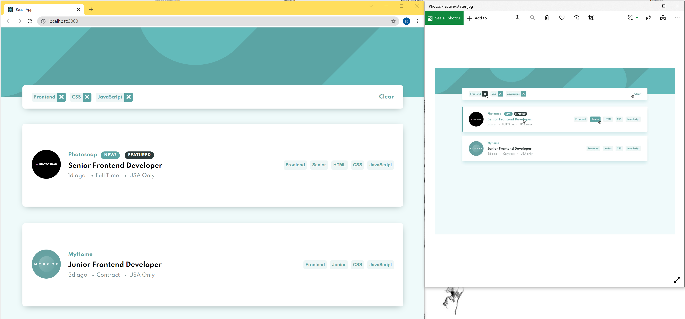
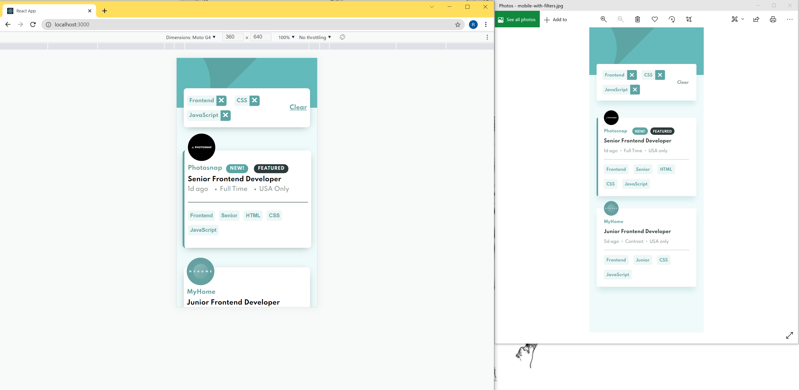

# Frontend Component Job List :eyes:

<p>

</p>
<p>

</p>

### Table of Contents

- [Description](#description)
- [Technologies](#technologies)
- [What I learned](#what-i-learned)
- [License](#license)
- [Author Info](#get-in-touch)

---

## Description

This is a solution to the [Job listings with filtering challenge on Frontend Mentor](https://www.frontendmentor.io/challenges/job-listings-with-filtering-ivstIPCt). All code are original.

The app can be accessed at the link below.

> https://ran-joblist.netlify.app/

---

## Technologies

- Frontend: React.js, JavaScript, HTML & CSS

---

## What I learned

- css: show left border on hover

```css
/* Bad option: set border-left but it will change the box size and element will move */
.container:hover {
  border-left: 5px solid var(--desaturated-dark-cyan);
}

/* Good option: make use of :before & take it out of the document flow */
.container:hover:before {
  content: "";
  position: absolute;
  left: 0;
  top: 0;
  display: block;
  height: 100%;
  width: 5px;
  background-color: var(--desaturated-dark-cyan);
}
```

- css: vertical center anchor tag inside div

```css
div {
  display: table-cell;
  margin: auto 0;
}
/* or can set line height for anchor tag which will adds to the padding of the container  */
```

- TypeScript: useRef in TypeScript

```ts
// error: Type 'MutableRefObject<undefined>' is not assignable to type 'LegacyRef<HTMLSpanElement> | undefined'. Type 'MutableRefObject<undefined>' is not assignable to type 'RefObject<HTMLSpanElement>'. Types of property 'current' are incompatible. Type 'undefined' is not assignable to type 'HTMLSpanElement| null'.

// option 1
const currTag = useRef<HTMLSpanElement>(null);

//option 2
const currTag = useRef() as React.MutableRefObject<HTMLSpanElement>;
```

- TypeScript: Type Assertion TypeScript

```ts
// option 1 // as
const myCanvas = document.getElementById("main_cavas") as HTMLCanvasElement;

//option 2 // <>
const myCanvas = <HTMLCanvasElement>document.getElementById("main_canvas");
```

## License

MIT License

---

## Get in touch

<div>
  <a href="https://www.instagram.com/ranwren/">
    <div>@ranwren</div>
    
  </a>
<a href="https://www.linkedin.com/in/ding-ran/">
  <div>@Ran Ding</div>
    
  </a>
</div>

[Back To The Top](#)
